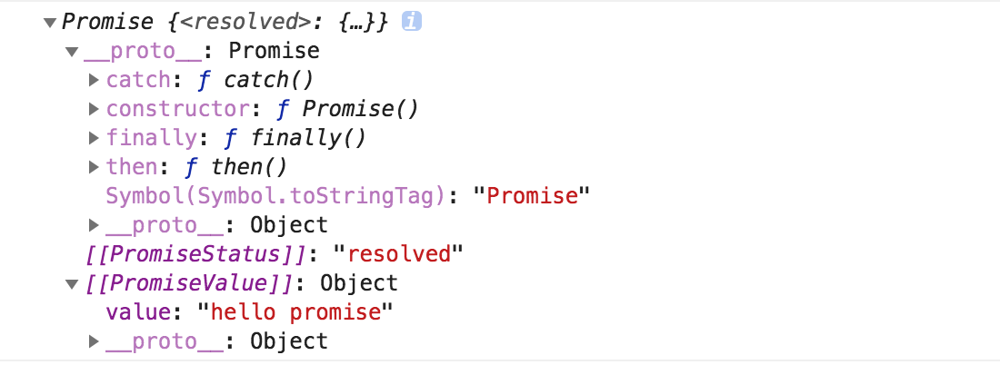

# promise 非同步編程
`Promise` 是非同步編程的一種解決方案。    

Promise是一個原生構造函數，通過new可生成promise實例。它接受一個函數作為參數，並且這個函數有`resolve`和`reject`兩個參數。    
  
promise有三種狀態，分別是`pending`(等待，未完成)、`resolved`(成功)、`rejected`(失敗)。  

### 一，基本使用     
#####  promise實例
```js  
// promise實例
const promise = new Promise(function(resolve, reject) {
  // ...做一些事情
  if (/* 非同步操作成功 */){
    resolve(value);
  } else {
    // 非同步操作失敗則reject
    reject(error);
  }
});  

```  
這個promise實例結構如下:  

  
#####  完整案例  
```js
const promise = new Promise((resolve, reject)=>{  

  // ...做一些事情  

  if (/* 非同步操作成功 */){  

    resolve(value);
  } else {  

    // 非同步操作失敗則reject
    reject(error);
  }
});    

promise
  .then(
    value=>{ // resolve回調函數
       // 成功
    },
    error=>{ // reject回調函數
      // 失敗
    }
  )
  .catch(error=>{
   // 異常捕獲
  })
  .finally(()=>{  
    // 沒有參數
   // 不管成功還是失敗，都會執行。
  })
```
> finally是ES2018(ES9)新增的promise實例方法  

### 二，promise實例方法   

#### then方法  
then()是promise的一個實例方法，它接受兩個回調函數作為參數，第一個回調是當`pending=>resolved`時調用，表示成功，
第二個回調是當`pending=>rejected`時調用，表示失敗。  

> then方法執行完會返回一個新的promise實例，因此它還可以接下一個then，下一個then...,可採用鏈式寫法。

```js
const promise = new Promise((resolve, reject)=>{  
  // ...做一些事情  
  if (true){  
    resolve(1);
  } else {  
    reject(2);
  }
})    
// 第一個then，處理完後返回一個新的promise實例
.then(  
    // resolve回調函數
    value=>{ 
       console.log(value); // 1
       return 11;
    },  

    // reject回調函數
    error=>{ 
      console.log(error); // 2
      return getJSON(post.commentURL); // 返回一個promise實例給下一個then 
    }
)  
// 第二個then，處理上一個then返回的結果
.then(  
    // resolve回調函數
    value=>{ 
       console.log(value); // 11
    },  

    // 上一個then如果返回promise實例，並且是reject狀態，則執行這個回調
    error=>{ 
      console.log(error); // 22
    }
)  
// 第三個then  
...
...
以此類推
```  
> 總之，error回調總是rejected的時候才會被調用，如果上一個then沒有返回promise實例，或者返回的promise實例沒有rejected，則不會調用。   

#### catch方法  

```js
getJSON('/posts.json')
 .then(posts=>{
   // ...
 })
 .then(value=>{
   // ...
 })
 .catch((error)=>{ 
   // 異常捕獲
   // 處理 getJSON 和 前一個回調函數運行時發生的錯誤
   console.log('發生錯誤！', error);
 });
```  

#### finally方法

```js
fetch('/posts.json')  // 注意: 請求本地json文件時，這裡的路徑是相對於index.html的
 .then(value=>{
    // ...
 })
 .then(value=>{
   // ...
 })
 .catch(error=>{ 
   // 異常捕獲
   // 處理 getJSON 和 前一個回調函數運行時發生的錯誤
   console.log('發生錯誤！', error);
 })
 .finally(()=>{
   // 最後執行
   // 不管成功失敗都會執行
 })
```    

### 三，一些經典案例   

##### 1，使用promise封裝ajax   
原生ajax並不支持promise，但我們可以用promise封裝它。  
```js
const getJSON =( url )=>{    
    return new Promise(function(resolve, reject) {      
        const XHR = new XMLHttpRequest();   
        XHR.open('GET', url, true);        
        XHR.send();        
        XHR.onreadystatechange =()=>{           
        if (XHR.readyState == 4) {                
            if (XHR.status == 200) {                    
                try {                        
                    const response = JSON.parse(XHR.responseText);                        
                    resolve(response);                    
                } 
                catch (e) {                        
                        reject(e);                    
                }                
            } 
            else {                    
                reject(new Error(XHR.statusText));                
            }            
        }        
    }    
})}   

getJSON('./post.json')
 .then(data=>{
   // 拿到數據後，做一些處理
   if(data.code===200){
       console.log(data);
      // alert("請求成功");
   }else{
       alert(`請求失敗:${data.msg}`);
   }
 })
 .catch(error=>{ 
   // 異常捕獲
   // 處理 getJSON 和 前一個回調函數運行時發生的錯誤
   console.log('發生錯誤！', error);
 })
 .finally(()=>{
    console.log('請求處理結束');
   // 最後執行
   // 不管成功失敗都會執行
 })
```


##### 2，使用fetch請求本地json文件  
fetch請求預設會返回一個promise。
```js
fetch('./post.json')  // 注意: 請求本地json文件時，這裡的路徑是相對於index.html的
 .then(response=>{
    // 解析json數據
    return response.json();
 })
 .then(data=>{
   // 拿到數據後，做一些處理
   if(data.code===200){
       console.log(data);
      // alert("請求成功");
   }else{
       alert(`請求失敗:${data.msg}`);
   }
 })
 .catch(error=>{ 
   // 異常捕獲
   // 處理 getJSON 和 前一個回調函數運行時發生的錯誤
   console.log('發生錯誤！', error);
 })
 .finally(()=>{
    console.log('請求處理結束');
   // 最後執行
   // 不管成功失敗都會執行
 })
```

### 四，Promise.all([p1, p2, p3...])方法  
Promise.all方法用於將多個 Promise 實例，包裝成一個全新的 Promise 實例，也就是包裝實例。而傳入的promise實例可以稱之為內部實例。

> 1，只有內部實例全部處於fulfilled狀態時，這個包裝實例才會處於fulfilled狀態。並且內部實例的返回值會組成一個數組返回給包裝實例。   

> 2，當內部實例中有一個被rejected時，包裝實例的狀態也會變成rejected，並且這第一個被rejected的內部實例的返回值會傳遞給包裝實例  

案例：
```js
// 生成一個Promise對象的數組
const promises = [2, 3, 5, 7, 11, 13].map(function (id) {
  return getJSON('/post/' + id + ".json");
});

Promise.all(promises).then(function (posts) {
  // 當所有內部實例fulfilled時執行
}).catch(function(reason){
  // 異常捕獲
});
```  
> 注意：如果內部實例自訂了catch，則該內部實例拋出錯誤時不會再走包裝實例的catch，而是走自訂的catch。